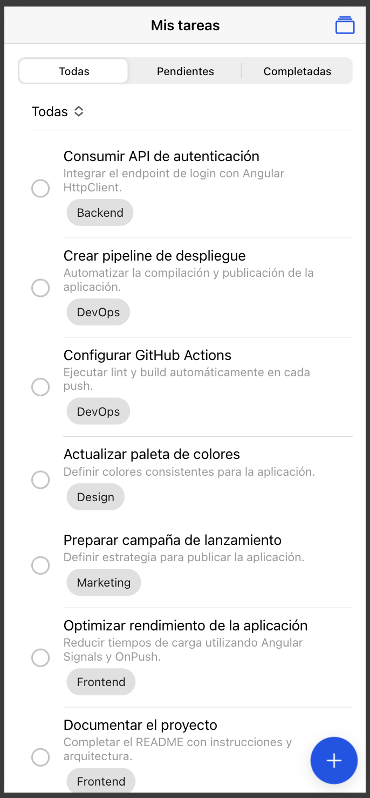
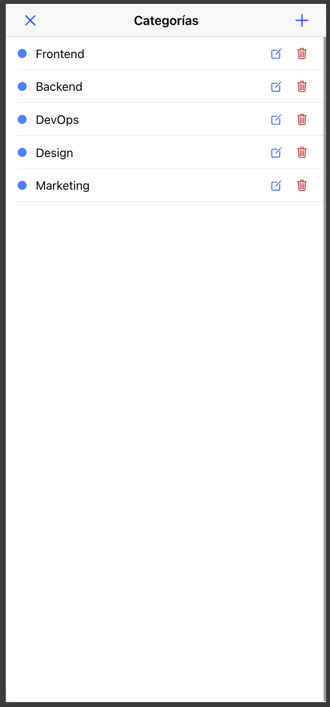
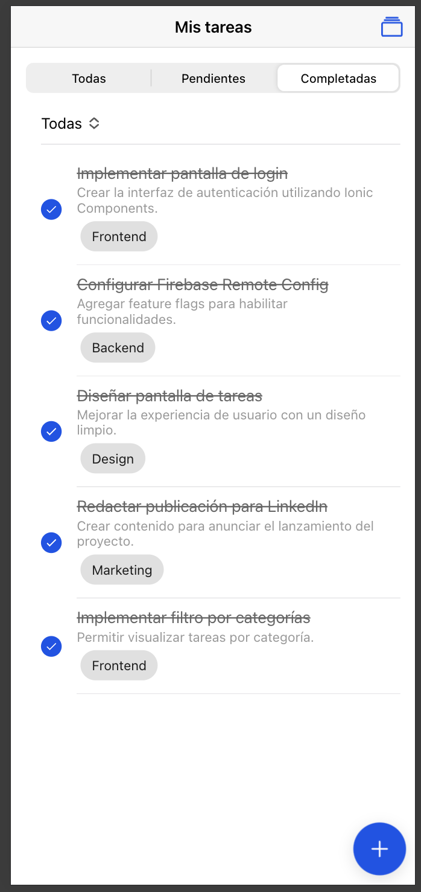
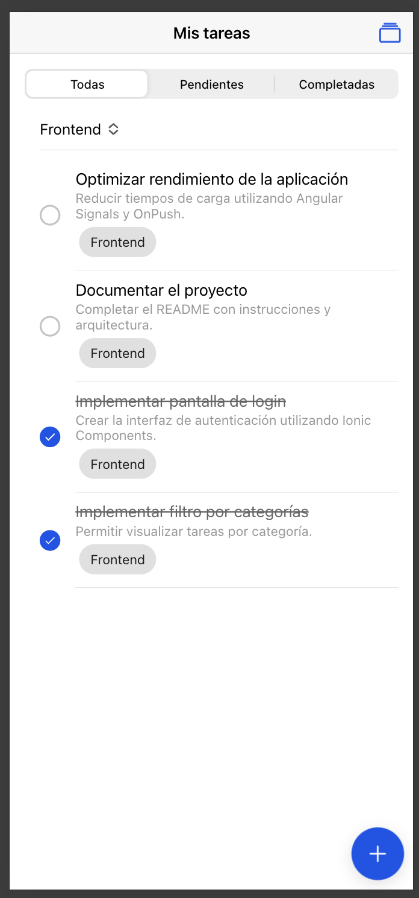
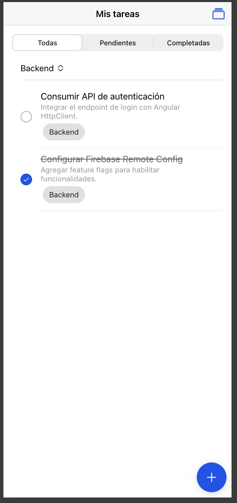
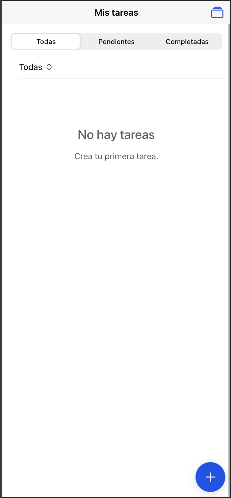
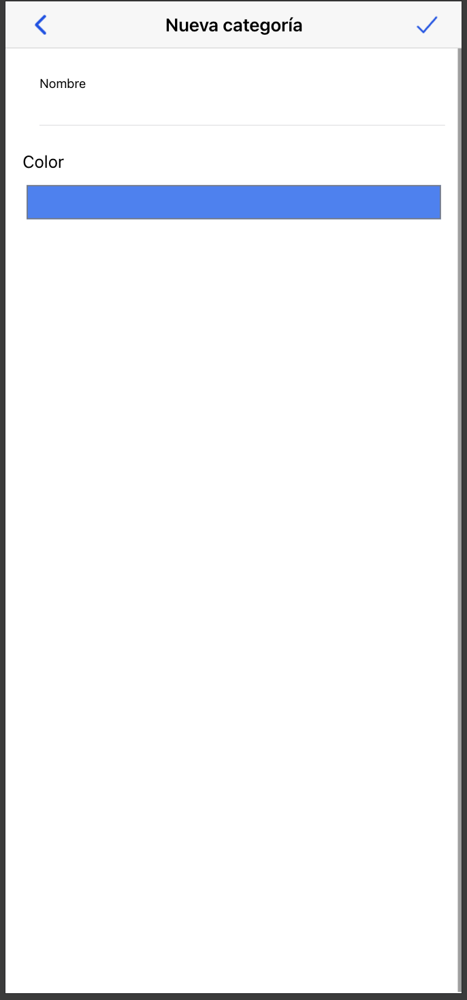

> **Importante:** Aunque el enunciado de la prueba menciona Cordova, desarrollé el proyecto utilizando **Capacitor 8**, ya que es la solución recomendada actualmente por Ionic para el desarrollo de aplicaciones híbridas. La aplicación fue probada correctamente en Web, Android e iOS.

# Instalación

## Requisitos previos

Antes de ejecutar el proyecto asegúrate de tener instalado:

- Node.js 22 o superior
- npm 10 o superior
- Angular CLI 20
- Ionic CLI
- Git
- Android Studio (para Android)
- Xcode 26 o superior (para iOS, solo macOS)

---

## 1. Clonar el repositorio

```bash
git clone https://github.com/jhoanjimz2/accenture-todo.git
```

Ingresar a la carpeta del proyecto.

```bash
cd accenture-todo
```

---

## 2. Instalar dependencias

```bash
npm install
```

---

## 3. Configurar Firebase

Por seguridad, el archivo con la configuración real de Firebase no se encuentra incluido en el repositorio.

Se dejó un archivo de ejemplo en la siguiente ruta:

```text
src/app/core/firebase/firebase.config-example.ts
```

### Configuración

1. Crear un proyecto en Firebase.

2. Registrar una aplicación Web.

3. Renombrar el archivo:

```text
src/app/core/firebase/firebase.config-example.ts
```

por:

```text
src/app/core/firebase/firebase.config.ts
```

4. Reemplazar los datos del objeto `firebaseConfig` por los correspondientes a tu proyecto.

Ejemplo:

```ts
export const firebaseConfig = {
  apiKey: 'TU_API_KEY',
  authDomain: 'TU_AUTH_DOMAIN',
  projectId: 'TU_PROJECT_ID',
  storageBucket: 'TU_STORAGE_BUCKET',
  messagingSenderId: 'TU_MESSAGING_SENDER_ID',
  appId: 'TU_APP_ID',
};
```

> **Importante:** El archivo `firebase.config.ts` está incluido en el `.gitignore`, por lo que no se publica la configuración del proyecto de Firebase. Solo debes renombrar `firebase.config-example.ts` y reemplazar los datos por los de tu propio proyecto.

---

## 4. Configurar Firebase Remote Config

Dentro de Firebase Console habilita **Remote Config** y crea el siguiente parámetro:

| Parámetro | Valor |
|-----------|-------|
| `enable_categories` | `true` |

Una vez creado, publica los cambios.

---

## 5. Ejecutar la aplicación

```bash
ionic serve
```

La aplicación estará disponible en:

```text
http://localhost:8100
```

---

# Android

## 1. Compilar la aplicación

```bash
ionic build
```

---

## 2. Sincronizar Capacitor

```bash
npx cap sync android
```

---

## 3. Abrir Android Studio

```bash
npx cap open android
```

---

## 4. Ejecutar

Selecciona un dispositivo físico o un emulador y ejecuta la aplicación desde el botón **Run ▶**.

---

## 5. Generar APK

Desde Android Studio:

```text
Build
    ↓
Build Bundle(s) / APK(s)
    ↓
Build APK(s)
```

El APK se generará en la siguiente ruta:

```text
android/app/build/outputs/apk/debug/app-debug.apk
```

---

# iOS

## 1. Compilar

```bash
ionic build
```

---

## 2. Sincronizar

```bash
npx cap sync ios
```

---

## 3. Abrir Xcode

```bash
npx cap open ios
```

---

## 4. Ejecutar

Selecciona un simulador y ejecuta la aplicación desde el botón **Run ▶**.

---

## Sobre el archivo IPA

No fue posible generar el archivo IPA porque no cuento con una cuenta de Apple Developer para realizar la firma de la aplicación.

Sin embargo, el proyecto fue probado y ejecutado correctamente en el simulador de iOS desde Xcode.

---

# Actualizar la aplicación después de realizar cambios

Después de realizar cualquier modificación en el proyecto ejecuta:

```bash
ionic build
```

Luego sincroniza Capacitor.

Android

```bash
npx cap sync android
```

iOS

```bash
npx cap sync ios
```

Si Android Studio o Xcode ya están abiertos, simplemente vuelve a ejecutar la aplicación.

---

# Scripts disponibles

Ejecutar en desarrollo

```bash
ionic serve
```

Compilar

```bash
ionic build
```

Sincronizar Android

```bash
npx cap sync android
```

Sincronizar iOS

```bash
npx cap sync ios
```

Abrir Android Studio

```bash
npx cap open android
```

Abrir Xcode

```bash
npx cap open ios
```

---

# Estructura del proyecto

```text
src/
│
├── app/
│   ├── core/
│   │   ├── constants/
│   │   ├── firebase/
│   │   └── services/
│   │
│   ├── features/
│   │   ├── categories/
│   │   └── tasks/
│   │
│   └── shared/
│
├── assets/
└── environments/
```


---

# Capturas de pantalla

## Pantalla principal

Vista principal de la aplicación con todas las tareas registradas.



---

## Gestión de categorías

Administración de categorías (crear, editar y eliminar).



---

## Tareas pendientes

Visualización del filtro de tareas pendientes.


---

## Tareas completadas

Visualización del filtro de tareas completadas.



---

## Filtro por categoría (Frontend)

Listado de tareas filtradas por la categoría **Frontend**.



---

## Filtro por categoría (Backend)

Listado de tareas filtradas por la categoría **Backend**.



---

## Estado inicial

Pantalla mostrada cuando aún no existen tareas registradas.



---

## Formulario de categoría

Formulario para crear una nueva categoría.


